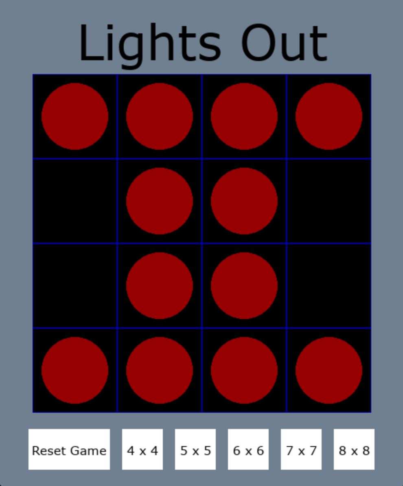
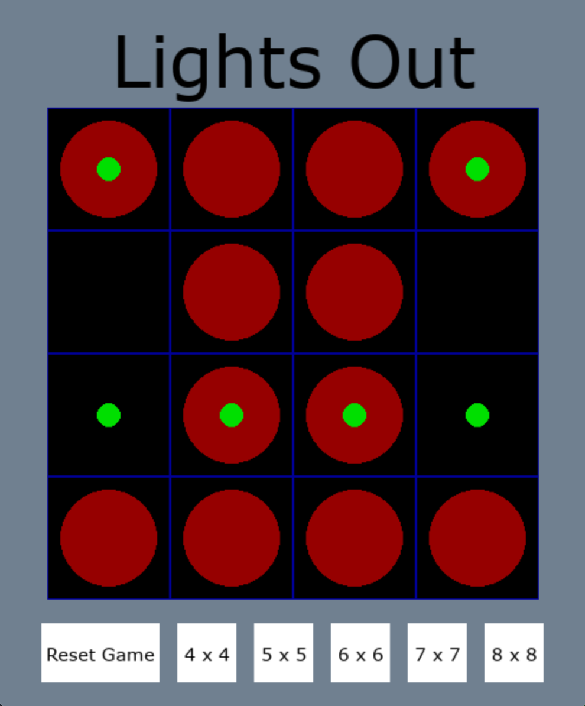

# Lights-Out-Solver

This is a fully playable implementation of the game Lights Out.

 

The objective of the game is to get all of the red "lights" on the board to disappear, so that only black empty squares are left. To turn any individual cell on the board on or off, simply click on the cell. The catch, however, is that clicking one cell switches the status of all cells adjacent to it. So if you click a cell surrounded by lights that are off, all the lights around it will turn on. 

This game can get very frustrating, so I've also implemented a function that will solve any valid board configuration. It works by converting the board into a matrix-vector product of the form Ax = b. Then we run Gaussian elimination to derive a solution vector. To get the solution while playing Lights Out, just press the spacebar. This puts a green circle in front of all the cells that need to be clicked to solve the puzzle. 

# References

I originally got the idea for a Lights Out solver from the excellent computational linear algebra textbook [Coding The Matrix](https://codingthematrix.com/) by Philip N. Klein.

For the actual implementation, I found [this video series](https://www.youtube.com/watch?v=oCHCD_-nhg4) by Mathapptician very useful.

